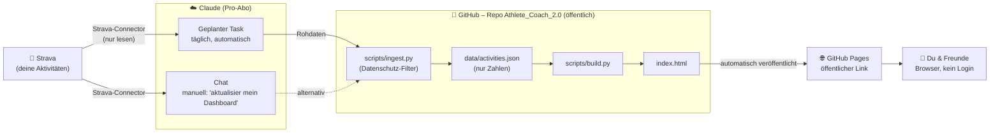

# Athlete Coach 2.0 – Architektur

> Stand: 04.10.2026 · Status: **erste Version gebaut** (Testgrafik), täglicher Task eingerichtet. Aktueller Arbeitsstand: [`STATUS.md`](STATUS.md).
> Diese Datei ist die maßgebliche Beschreibung der Architektur. Bei Änderungen hier zuerst anpassen.

---

## 1. Auf einen Blick

Ein **Claude-Task** holt einmal täglich deine neuen Trainings aus **Strava**, speichert sie in diesem **GitHub-Repo**, ein **Script** baut daraus die Dashboard-Seite, und **GitHub Pages** stellt sie unter einem öffentlichen Link ins Netz. Du und deine Freunde öffnen denselben Link – ohne Login.

Es gibt **keinen eigenen Server, keine Datenbank, keine API-Schlüssel**. Laufende Kosten: 0 € (zusätzlich zu Claude Pro und Strava-Abo, die du ohnehin hast).

---

## 2. Welches Tool übernimmt was?

| Baustein | Aufgabe | Wer betreibt es |
|---|---|---|
| **Strava** | Quelle aller Trainingsdaten (Uhr → Strava wie bisher) | Strava (Abo nötig) |
| **Strava-Connector** | Gibt Claude Lesezugriff auf deine Strava-Daten. Kann nichts in Strava ändern. | Strava / Claude |
| **Claude-Task** („Routine") | Läuft nach Zeitplan in der Cloud: holt neue Aktivitäten, filtert sie, schreibt sie ins Repo, startet das Build-Script, pusht. Optional: kurzer Coach-Text. | Claude (Pro-Abo) |
| **Claude-Chat** | Dasselbe von Hand anstoßen; außerdem Coaching-Fragen und Weiterentwicklung der App | Claude |
| **GitHub-Repo** | Speichert Daten, Script und Webseite. Ist gleichzeitig das „Archiv" mit kompletter Änderungshistorie. | GitHub (kostenlos) |
| **Build-Script** | Rechnet aus `activities.json` die KPIs und erzeugt die HTML-Seite. Rechnet immer gleich – Claude rechnet die Zahlen **nicht** selbst. | liegt im Repo |
| **GitHub Pages** | Stellt die Webseite öffentlich ins Netz | GitHub (kostenlos) |

**Grundprinzip:** Claude ist nur der *Zulieferer* der Daten. Script, Daten und Seite funktionieren ohne Claude. Fällt Claude weg, kann man die Daten auch anders ins Repo bringen (siehe Abschnitt 7).

---

## 3. Informationsfluss Schritt für Schritt

1. **Du trainierst.** Die Aktivität landet wie gewohnt in Strava.
2. **Der Task startet** – täglich gegen **22 Uhr** (genau: 21:59 Uhr Berlin).
3. Er fragt über den Strava-Connector alle Aktivitäten der **letzten 14 Tage vor der neuesten gespeicherten Aktivität** ab. Die Überlappung fängt auch nachträglich hochgeladene oder bearbeitete Einheiten ab; Doppelte werden erkannt.
4. **Filter** (`scripts/ingest.py`, festes Script – nicht Claude entscheidet): gespeichert werden nur Startzeit (lokal), Sportart, Distanz, Bewegungs- und Gesamtzeit, Höhenmeter. **Nicht** gespeichert: Strava-ID, Ortsangaben, GPS-Strecken, Aktivitätsnamen, Beschreibungen, Kudos. Neue Felder kommen nur durch eine bewusste Änderung an `KEEP` im Script dazu.
5. Neue Einträge landen in `data/activities.json`, Duplikate (gleiche Startzeit) werden überschrieben statt doppelt gespeichert.
6. Das **Build-Script** (`scripts/build.py`) rechnet alle Kennzahlen und erzeugt `index.html`.
7. Der Task **committet und pusht** direkt auf `main`.
8. **GitHub Pages** veröffentlicht die neue Version automatisch (dauert meist 1–2 Minuten).
9. Wer den Link öffnet, sieht den neuen Stand.

---

## 4. Wie laufen Updates?

| Weg | Wann | Aufwand |
|---|---|---|
| **Automatisch** (Claude-Task) | täglich ca. 22 Uhr | keiner |
| **Manuell im Chat** | jederzeit, z. B. direkt nach einem Wettkampf | ein Satz im Chat |

Beide Wege folgen derselben Schritt-für-Schritt-Anleitung: [`UPDATE.md`](UPDATE.md). Der Task-Prompt verweist nur auf diese Datei – Änderungen am Ablauf passieren also im Repo, nicht in den Task-Einstellungen.

**Was passiert, wenn ein Lauf ausfällt?** (Connector antwortet nicht, Claude-Kontingent erschöpft, …) Nichts geht verloren: Der nächste Lauf holt alles seit dem **letzten erfolgreichen** Lauf nach. Die Seite ist dann nur einen Tag älter.

**Von Hand gepflegte Daten:** `data/challenge.json` (Ziel der 1000-km-Challenge und Nicos km-Stände).
Der tägliche Task fasst diese Datei nicht an; Einträge kommen per Chat dazu → [`CHALLENGE.md`](CHALLENGE.md).

**Einen echten „Training fertig"-Auslöser gibt es nicht** – der Connector meldet sich nicht von selbst. Deshalb Zeitplan statt Echtzeit.

---

## 5. Wer hat welche Zugriffsrechte?

| Wer | Darf | Darf nicht |
|---|---|---|
| **Du** | alles (Repo, Task, Einstellungen) | – |
| **Claude-Task / Claude-Chat** | Strava **lesen**; nur **dieses eine Repo** lesen und beschreiben (über die Claude-GitHub-App, „Only select repositories") | Strava ändern; deine anderen Repos (z. B. die alte App) anfassen |
| **Freunde / alle Besucher** | Dashboard ansehen; Repo ansehen (ist öffentlich) | etwas ändern |

- Commits von Claude erscheinen im Repo mit dem Autor **„Claude“** – so ist in der Historie klar erkennbar, was automatisch und was von dir kam.
- Der Task läuft im Automatik-Modus, also **ohne Rückfragen**. Das ist gewollt.
- **Zugriff entziehen:** GitHub → Settings → Applications → Claude-App deinstallieren (GitHub) bzw. Strava-Connector in den Claude-Einstellungen trennen (Strava). Wirkt sofort.

**Wichtig – öffentlich heißt öffentlich:** Seite **und** Rohdaten im Repo sind für jeden einsehbar, der den Link kennt oder findet. Deshalb der Filter in Schritt 4.

---

## 6. Wie sehe ich das Dashboard? Wo liegt es? Wie sehen es Freunde?

- **Gehostet:** bei GitHub Pages, kostenlos.
- **Adresse:** `https://cpt-backfisch.github.io/Athlete_Coach_2.0/` – aktiv, sobald GitHub Pages eingeschaltet ist (Settings → Pages → *Deploy from a branch* → `main` / `/ (root)`).
- **Technik:** eine einzige, statische HTML-Datei ohne externe Skripte oder Bibliotheken; Diagramme als SVG direkt vom Build-Script erzeugt. `.nojekyll` schaltet GitHub-Pages-Verarbeitung ab, ausgeliefert wird 1:1.
- **Du:** Link im Browser öffnen. Tipp fürs iPhone: in Safari „Zum Home-Bildschirm" → wirkt wie eine App.
- **Freunde:** Du schickst ihnen den Link (z. B. per WhatsApp). Kein Konto, kein Login, keine App nötig.
- **Coaching-Fragen** („Wie war mein langer Lauf?", „Bin ich auf Kurs?") stellst du weiterhin direkt im Claude-Chat – dort hat Claude über den Connector Zugriff auf alle Details.

---

## 7. Abhängigkeiten & Ausfallszenarien

| Fällt weg | Folge | Ausweg |
|---|---|---|
| **Claude Pro** | Kein Task, kein Push aus Claude | Im kostenlosen Chat Daten abrufen lassen (Connector sollte verfügbar sein, nicht geprüft), Datei herunterladen und selbst ins Repo hochladen |
| **Strava-Abo** | Kein Connector | Strava-Datenexport (CSV) manuell ins Repo |
| **GitHub-Verbindung** läuft ab | Task überspringt Läufe bis zu 72 h, danach schaltet er sich ab | Neu verbinden, Task wieder einschalten |
| **Strava-Connector** wird geändert/eingestellt | Kein automatischer Abruf | Strava-API als Datenquelle nachrüsten (alte App hat Client-ID) |

Weil Daten, Script und Seite unabhängig von Claude sind, muss im Ernstfall nur der **Zulieferer** getauscht werden – nie die ganze App.

---

## 8. Kosten

| Dienst | Kosten |
|---|---|
| Claude Pro | bestehendes Abo; Task-Läufe zählen gegen das normale Nutzungskontingent (Lauf ≈ 1 Minute) |
| Strava | bestehendes Abo |
| GitHub + GitHub Pages | 0 € |
| **Zusätzlich** | **0 €** |

---

## 9. Entscheidungen & offene Punkte

**Entschieden**
- Datenquelle: Claude-Task über Strava-Connector, **keine** Strava-API
- Hosting: GitHub Pages, öffentlich, ohne Login – eine Seite für dich und Freunde
- Repo öffentlich, Rohdaten öffentlich (gefiltert) – akzeptiert
- Task pusht ohne Rückfrage direkt auf `main`
- Update mindestens 1× täglich, manuell jederzeit im Chat
- Kein GitHub-Actions-Workflow nötig (Pages liefert direkt aus dem Repo aus)
- **Öffentliche Anzeige der Strava-Daten:** von Sebastian geprüft und freigegeben (04.10.2026). Kein offener Punkt mehr.
- Task-Zeit: täglich 21:59 Uhr (Europe/Berlin)
- Nur Python-Standardbibliothek, keine Abhängigkeiten; Seite ohne externe Ressourcen
- Datenschutz-Filter als Code (`ingest.py`), Duplikat-Schlüssel = lokale Startzeit, keine Strava-ID im Repo
- 1000-km-Challenge: Nicos Daten manuell in `data/challenge.json` (Connector sieht nur Sebastians Konto); Name und km öffentlich, mit Nico abgestimmt

**Getestet**
- ✅ Geplanter Task kann Strava-Daten abrufen (04.10.2026, ohne Rückfragen)
- ✅ Push auf `main` aus einer Claude-Sitzung (04.10.2026)
- ✅ Geplanter Task: Strava-Abruf **und** Push auf `main` in einem Lauf, ohne Rückfragen, Dauer ca. 30 Sekunden (04.10.2026)
- Hinweis aus dem Test: Das Repo ist in der Task-Sitzung bereits automatisch geklont. Der Task-Prompt soll das vorhandene Repo nutzen und nur falls es fehlt selbst klonen.

**Offen** → siehe [`STATUS.md`](STATUS.md)
